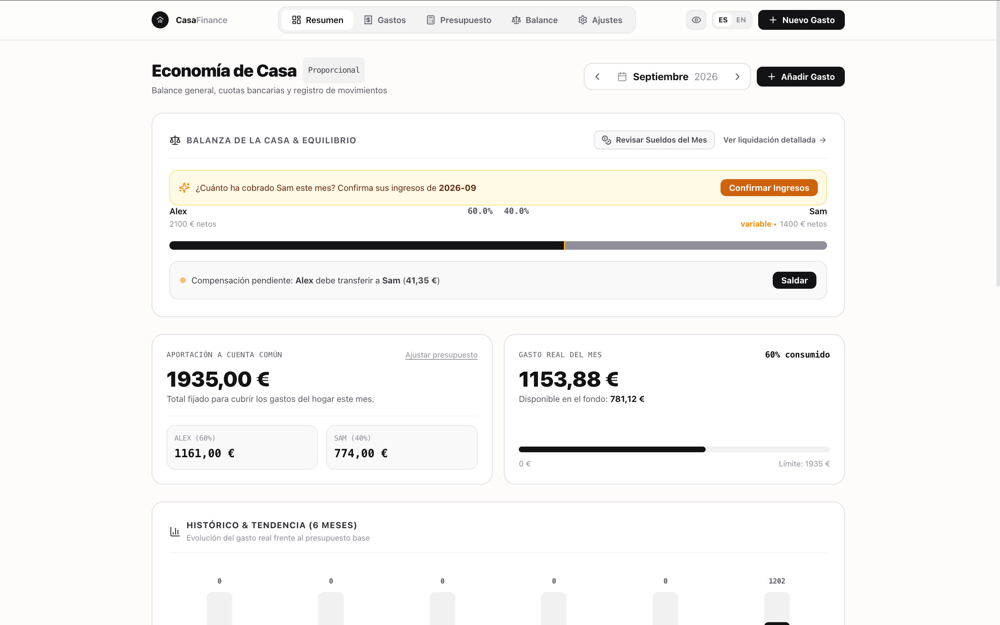
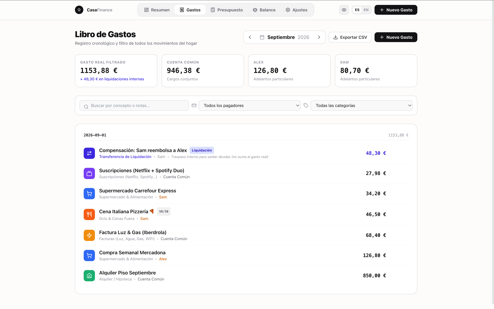
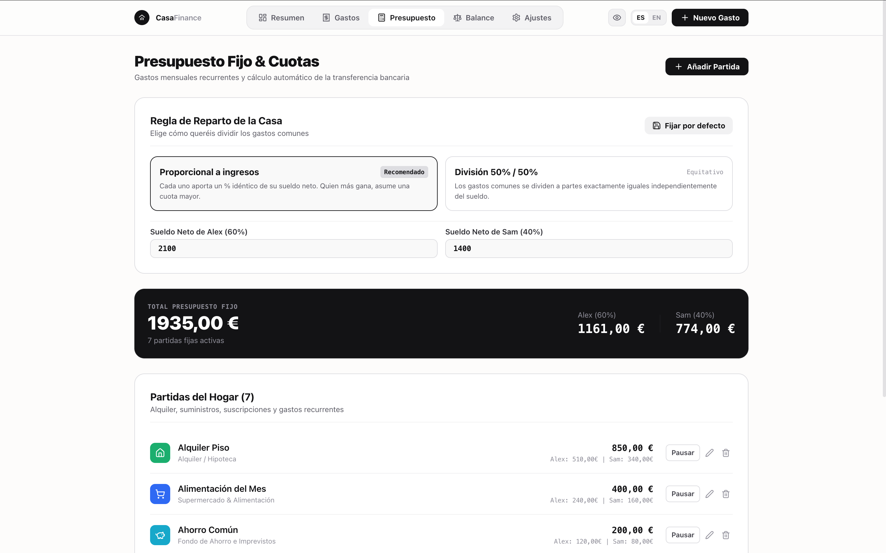
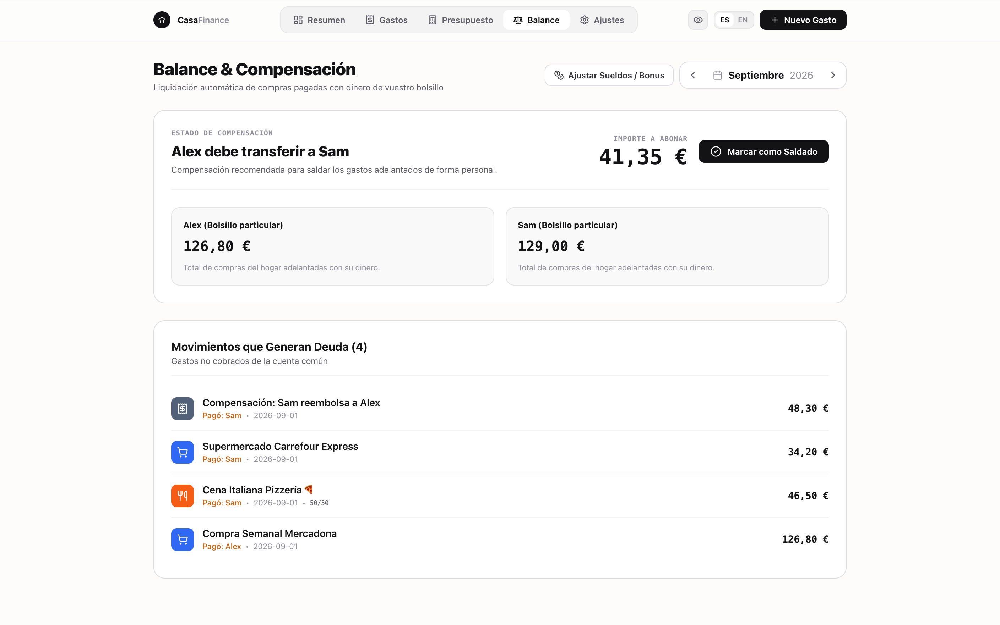
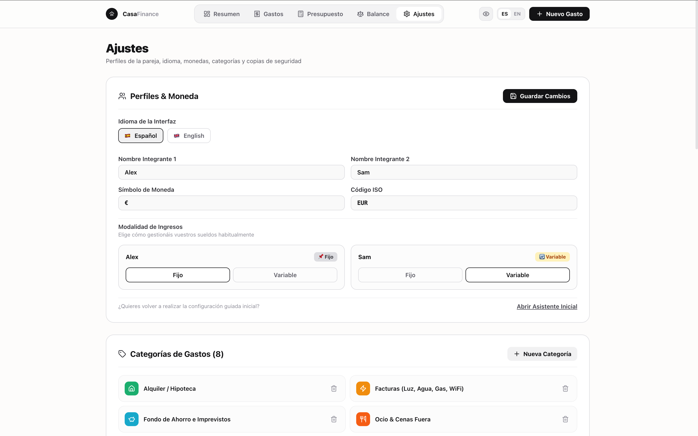

# 🏠 CasaFinance

> Gestor financiero y de presupuesto inteligente para parejas. Privado, reactivo, local-first, con soporte para IA/OCR y listo para Docker.

Dividir los gastos al 50/50 cuando los ingresos no son idénticos suele ser injusto o complejo de calcular mes a mes. **CasaFinance** resuelve esto calculando automáticamente la aportación exacta que cada miembro debe hacer a la cuenta común de forma **proporcional a sus ingresos netos**, con la flexibilidad de forzar división al 50/50 en gastos puntuales y soporte para meses con bonus o sueldos variables.

---

## 📸 Capturas de Pantalla / Interface Preview

### 🏠 1. Dashboard Principal & Balanza del Hogar
> Visualiza el reparto proporcional equitativo, el gasto real consumido y las alertas inteligentes de ingresos mensuales.

<p align="center">
  
</p>

---

### 💳 2. Libro de Gastos & Movimientos
> Registro cronológico de compras con categorización visual y separación estricta de transferencias de liquidación.

<p align="center">
  
</p>

---

### 📊 3. Presupuesto Fijo & Cálculo Automático de Cuotas
> Define las partidas fijas del hogar y obtén el importe exacto que cada miembro transfiere a la cuenta común.

<p align="center">
  
</p>

---

### ⚖️ 4. Balance & Compensación Automática de Adelantos
> Liquidación automática de compras particulares pagadas del propio bolsillo sin alterar el fondo de gastos comunes.

<p align="center">
  
</p>

---

### ⚙️ 5. Ajustes: Modalidad de Sueldos (Fijo / Variable) & IA OCR
> Configura sueldos estables o variables independientemente para cada miembro, moneda, idioma y Visión OCR.

<p align="center">
  
</p>

---

## ✨ Características Principales

- ⚖️ **Reparto Proporcional**: Calcula automáticamente la cuota mensual exacta y justa que cada uno transfiere a la cuenta común según sus ingresos netos.
- 🔄 **Sueldos Fijos o Variables por Integrante**: Configura si cada miembro tiene nómina fija o ingresos variables (autónomos, comisiones, horas extra). La app te avisará al inicio de cada mes para confirmar los ingresos variables.
- 🪙 **Ajustes de Mes Puntuales o Fijos**: ¿Paga extra o bonus este mes? Modifícalo puntualmente para este mes sin alterar vuestro sueldo base habitual, o actualiza la nómina de referencia con 1 clic.
- 💳 **Liquidación Automática de Adelantos**: Si alguien paga compras del hogar de su bolsillo, el sistema calcula la compensación al céntimo. Las liquidaciones no inflan el gasto real de la casa.
- 📸 **Escáner de Tickets con IA (OCR)**: Saca una foto al ticket y la IA (local con Ollama `llama3.2-vision` o en la nube) extrae comercio, total, fecha y categoría automáticamente.
- 💬 **Bot de WhatsApp para la Pareja**: Apunta gastos al instante desde vuestro grupo de WhatsApp con lenguaje natural (`"42.50 Mercadona"`, `"18 Farmacia adelanto"` o `"!balance"`).
- 🎯 **Metas de Ahorro Compartidas**: Crea botes de ahorro (vacaciones, fondo de emergencia, compras...) con barras de progreso, aportaciones y retiradas.
- 📊 **Balanza del Hogar & Histórico**: Visualización en tiempo real del equilibrio financiero y evolución del gasto real frente al presupuestado.
- 👁️ **Modo Privacidad**: Oculta los importes y sueldos con un toque para usar la app en lugares públicos.
- 📥 **Exportación a CSV**: Descarga el libro de gastos filtrado por mes compatible con Excel, Google Sheets y Numbers.
- 🔀 **Excepciones 50/50 por Gasto**: Fuerza división 50/50 en compras concretas (cenas, caprichos o suscripciones).
- 🌐 **Totalmente Bilingüe**: Cambia entre **Español 🇪🇸** e **Inglés 🇬🇧** al instante.
- 🔒 **100% Privado y Local**: Tus datos se guardan en tu propio servidor SQLite (`./data/casafinance.db`).
- 📱 **Instalable como App Móvil (PWA)**: Añádela a la pantalla de inicio en iOS y Android.
- 🐳 **Listo para Docker**: Despliegue en 1 minuto en tu servidor doméstico, VPS, NAS o Raspberry Pi.

---

## 📸 Escáner de Tickets con IA (Ollama Local / OpenAI)

CasaFinance integra un motor OCR de visión inteligente. Puedes configurarlo en la sección **Ajustes**:

### Opción A: 100% Local y Privado con Ollama (Recomendado)
1. Instala Ollama en tu ordenador o servidor: `https://ollama.com`
2. Descarga el modelo de visión:
   ```bash
   ollama run llama3.2-vision
   ```
3. En **Ajustes > Escáner de Tickets con IA**, selecciona *Ollama Local* (`http://localhost:11434/api/generate`).

### Opción B: OpenAI Vision
Si prefieres no ejecutar modelos de visión pesados en local, introduce tu API Key de OpenAI y el modelo `gpt-4o-mini` en Ajustes.

---

## 🤖 Bots de Mensajería (Telegram Oficial & WhatsApp)

CasaFinance permite apuntar gastos al instante desde vuestro grupo de chat con lenguaje natural (`"42.50 Mercadona"`, `"60 Cena 50/50"`, `"18 Farmacia adelanto"` o `"!balance"`):

### Opción A: Telegram (100% Oficial, Seguro y Gratuito) — Recomendado
1. En Telegram, habla con `@BotFather` y escribe `/newbot` para crear tu bot y obtener tu Token.
2. En **Ajustes > Bot de Mensajería**, selecciona **Telegram**, pega tu Token y el nombre de tu grupo.
3. Arranca el microservicio de Telegram:
   ```bash
   docker compose up -d telegram-bot
   ```

### Opción B: WhatsApp (Sesión Dedicada)
> [!WARNING]
> **Aviso de Seguridad:** No se recomienda utilizar tu cuenta personal de WhatsApp. Para garantizar la privacidad de tus chats personales y evitar problemas de sesión con Meta, se aconseja utilizar una **segunda línea / SIM prepago dedicada** exclusivamente para el bot, o bien optar por **Telegram** (Opción A), que opera mediante una API oficial, segura y aislada.

1. En **Ajustes > Bot de Mensajería**, indica el nombre exacto de vuestro grupo de WhatsApp (ej. `Gastos Casa`) para aislarlo por seguridad.
2. Arranca el microservicio de WhatsApp:
   ```bash
   docker compose up -d whatsapp-bot
   docker compose logs -f whatsapp-bot
   ```
3. Escanea el código QR con el número de WhatsApp secundario deseado.

---

## 🚀 Despliegue con Docker

### 1. Clonar el repositorio
```bash
git clone https://github.com/iamcarron/CasaFinance.git
cd CasaFinance
```

### 2. Arrancar con Docker Compose
```bash
docker compose up -d --build
```

La aplicación estará lista en `http://localhost:3000` (o `http://<IP-DE-TU-SERVIDOR>:3000`).

---

## 💻 Desarrollo Local

**Requisitos**: Node.js 20+ y npm.

```bash
# 1. Instalar dependencias
npm install

# 2. Iniciar servidor de desarrollo
npm run dev

# 3. Compilar para producción
npm run build
npm start
```

---

## 📱 Añadir a la Pantalla de Inicio (PWA)

- **iOS (Safari)**: Pulsa el botón *Compartir* → *"Añadir a la pantalla de inicio"*.
- **Android (Chrome)**: Pulsa el menú de 3 puntos → *"Instalar aplicación"*.

---

## 🔄 Actualización a Nuevas Versiones

Actualizar tu servidor es tan sencillo como ejecutar el script de auto-actualización incluido (crea backup de la base de datos y actualiza los contenedores sin tocar tus datos ni cerrar la sesión de WhatsApp):

```bash
./update.sh
```

*(O manualmente con `git pull && docker compose up -d --build`)*.

---

## 📄 Licencia y Uso Comercial

Este proyecto está distribuido bajo la **Licencia PolyForm Noncommercial 1.0.0** (Consulta el archivo [`LICENSE`](./LICENSE) para el texto legal íntegro).

- ✅ **Uso Personal, Familiar y Doméstico**: 100% Libre y gratuito para autoalojamiento y uso privado.
- 💼 **Uso Comercial, Servicios en la Nube (SaaS) o Distribución de Pago**: Queda estrictamente prohibida la explotación comercial o monetización de este software sin un acuerdo previo. Si deseas utilizar CasaFinance para fines comerciales, contacta con el autor para adquirir una **licencia comercial**.

Copyright (c) 2026 CasaFinance & IamCarron. Todos los derechos reservados para usos comerciales.
